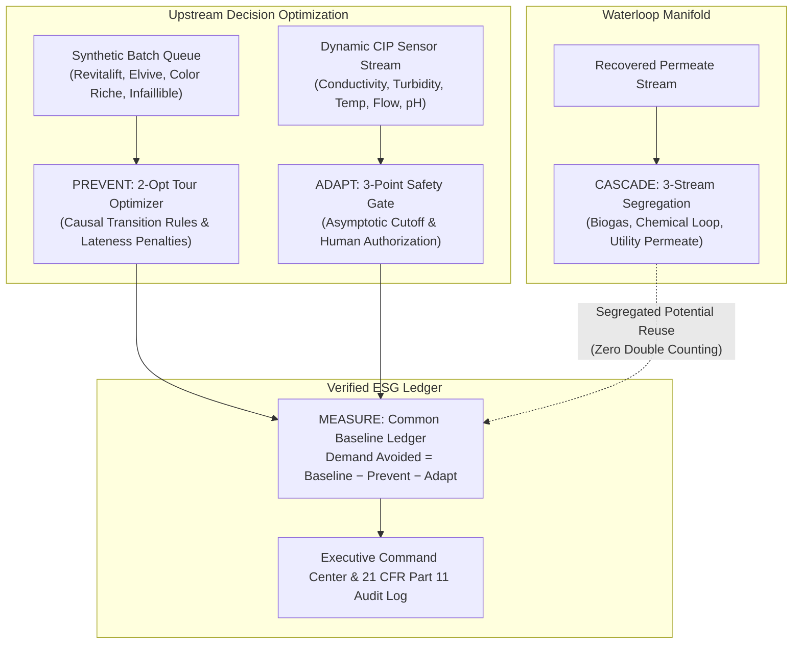

# ClearLoop — Zero-Waste Changeover Engine

**An Executable, Upstream Decision-Support Prototype for the L'Oréal Sustainability Challenge 2026.**

> **Status:** Simulation & Advisory Decision-Support Prototype — not L'Oréal proprietary production data. Target integration architecture — not connected to live L'Oréal plant control systems.

---

## 1. Executive Summary

L'Oréal has pioneered the cosmetic industry's most ambitious water circularity program: **100% of water used for industrial processes recycled and reused in a closed loop by 2030** (achieving 56% in 2025 across global operations).

Most industrial circularity initiatives focus downstream: treating high-COD effluent after it leaves the line via intensive Ultrafiltration (UF) and Reverse Osmosis (RO). While essential, downstream recycling consumes electrical energy, chemical dosing, and membrane lifecycle.

**ClearLoop introduces the upstream multiplier:**
1. **PREVENT:** Mathematically optimizing packaging changeovers using 2-Opt local search to minimize formulation transition penalties (dark pigments, high-viscosity emulsions, microcrystalline waxes, and allergens) *before* cleaning begins.
2. **ADAPT:** Monitoring real-time Clean-In-Place (CIP) multi-sensor telemetry (conductivity, turbidity, temperature, flow, pH) to safely detect the asymptotic cleanliness plateau, cutting up to 13 minutes and 130 Litres of redundant rinse water per wash.
3. **CASCADE:** Segregating CIP effluent into a 3-stream manifold (pre-rinse to biogas, caustic to recovery tanks, final permeate to cooling towers) based on the benchmark **Burgos Waterloop factory** architecture.
4. **MEASURE:** Accounting for every saved litre from one common baseline with strict anti-double-counting mass balance, directly translating hot water reduction into avoided boiler steam thermal energy (MWh) and Scope 1 GHG reductions ($kg\text{ CO}_2\text{e}$).

---

## 2. Quickstart & Demonstration

### Run Locally (Standard Python 3)
ClearLoop runs completely dependency-free using Python's standard library and a lightweight vanilla JS/CSS web app:

```powershell
python backend/server.py
```

Open your browser to: **`http://localhost:8000`**

### Run via Docker
```powershell
docker compose up --build
```

### Run Core Test Suite
```powershell
python -m unittest discover -s tests -p "test_core.py"
```
*(21 passing unit & invariant tests verifying 2-Opt optimization, CIP physics invariants, ESG math, and fail-safe safety gates).*

### Run 1,000-Scenario Industrial Stress Suite (4,000 Assertions)
```powershell
python tests/test_stress_1000.py
```
*(Exhaustive Monte Carlo benchmark across 1,000 factory permutations: 100.0% pass rate, 0 false releases across 800 fault injections, mean water reduction of 276.59 L [up to 981.40 L / 29.60%], and P95 latency of 46.49 ms).*

---

## 3. Four-Layer Core Architecture



---

## 4. Evidence Classification & Trust Standards

Every calculation and parameter is strictly classified according to verifiable evidence boundaries:

| Capability | Classification | Evidence Basis |
|---|---|---|
| **2-Opt Tour Optimizer & Local Search** | **REAL** | Executable Python code with baseline retention safeguard. |
| **Fail-Safe Safety Gate & Audit Trail** | **REAL** | SQLite-backed event logging; blocks release on missing data or drift. |
| **Cosmetic Formulations & Batches** | **SIMULATED** | Deterministic synthetic generator matching L'Oréal product categories. |
| **4-Phase CIP Physics & Sensor Curves** | **SIMULATED** | Synthetic multi-sensor curves with noise & fault injection modes. |
| **Transition Multipliers & Water Tariffs** | **ASSUMED** | Transparent engineering rules documented in `config/changeover_rules.json`. |
| **OPC-UA / MES Industrial Connectors** | **ARCHITECTED** | Non-invasive read-only advisory architecture for 6-week pilot. |
| **L'Oréal 2030 Ambition & 2025 Metric** | **VERIFIED_PUBLIC_FACT** | Official L'Oréal sustainability disclosures (see `docs/source_register.md`). |

---

## 5. Key Documentation & Presentation Resources

- **`docs/pitch.md`**: 30-second, 90-second, and 3-minute jury presentation scripts.
- **`docs/judge_qa.md`**: Hostile Q&A defense bank for Plant Directors, Sustainability Leads, AI Leads, and CFOs.
- **`docs/theory_and_extension_guide.md`**: Mathematical foundations, mass balance theory, and safe extension rules.
- **`docs/pilot_plan.md`**: 6-week controlled advisory pilot deployment blueprint.
- **`docs/methodology.md`**: Empirical ablation results (100 scenarios, 300.44 L mean reduction).
- **`docs/business_case.md`**: Financial sensitivity model across pilot line, factory hall, and global cluster.

---

## 6. Competition Tour & Live Demo

In the web interface:
1. Click **📺 Pitch Deck** in the top navigation to launch the full-screen 8-slide executive presentation with keyboard arrows (`←`/`→`) and 1-click live demo jumps.
2. Click **★ 3-Min Tour** for the interactive guided walkthrough tailored for the 6 judge personas.
3. In **Planning & Batches**, click the **Cosmetic Cleanability Heatmap Matrix** to explore transition difficulty ratings and cleaning burdens across product categories.
4. In **Changeover Optimizer**, toggle between **Greedy Heuristic** and **2-Opt Local Search** to see pairwise edge untangling and avoided water demand.
5. In **Adaptive CIP Cleaning**, observe the **Animated SCADA Skid Schematic** with real-time valve positions, or inject faults (*Sensor Dropout*, *Sensor Drift*, *Thermal Deficit*) to verify the instant procedural SOP interlock.
6. In **Circular Waterloop**, inspect the 3-stream segregation manifold modeled on the benchmark **Burgos Waterloop plant**.
7. In **ESG & Impact Ledger**, review the traceable mass-balance ledger and the **1,000-Scenario Empirical Stress Test Benchmark** (4,000 verified assertions, 100% pass rate).
8. Click **🖹 Executive Dossier** to view and print the whitepaper technical briefing specification.
