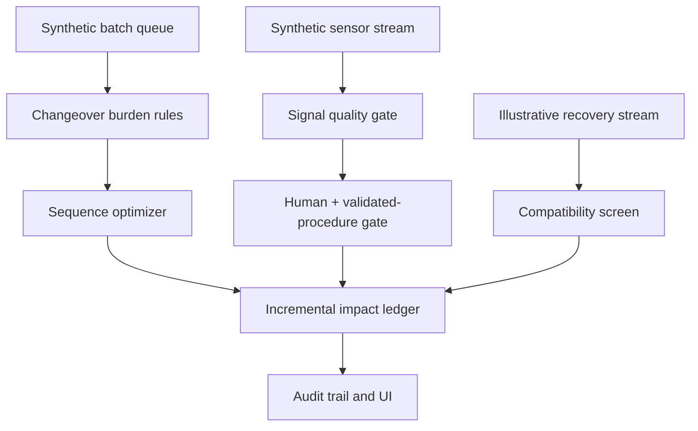

# Architecture

The local server implements this path using a deterministic demo seed. It is a real executable prototype. The input data and plant behaviors are simulated. Any future connection to MES, historian, LIMS, treatment controls, or identity service is target integration architecture only. See `data_model.md` for implemented and target persistence boundaries.
