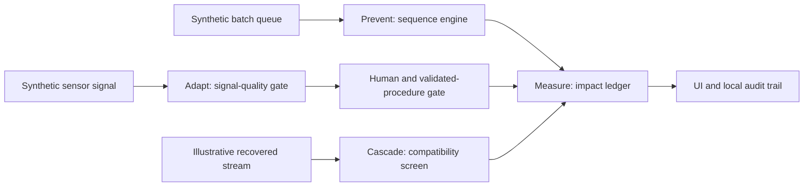

> **Archived.** This describes ClearLoop, the cosmetics clean-in-place
> project ChangeLoop grew out of. Its numbers and claims are for that
> product, not this one. Kept for the method: the evidence labels here
> became the evidence classes enforced in `core/factors.py`, and the
> rule that recovered water is never added to avoided demand is still
> the accounting invariant. See [README](README.md).

---

# ClearLoop theory and extension guide

## 1. What this project is trying to solve

ClearLoop is a decision-support prototype for reducing **modeled** cleaning-water demand around product changeovers. The idea is to make decisions before cleaning begins:

1. Choose a sequence that reduces the modeled burden of moving between batches.
2. Use process signals to support a cleaning-endpoint recommendation.
3. Screen whether a recovered stream could be considered for a later non-product use.
4. Account for each contribution from one baseline without counting the same water twice.

The prototype does not control equipment. It does not release cleaning. It does not approve water reuse. It shows what a future pilot could measure and review.

> **Simulation — not L'Oréal production data.**
>
> **Target integration architecture — not connected to L'Oréal systems.**

## 2. The central idea

Many water projects begin at treatment or recovery. ClearLoop starts earlier, at the upstream decision. If a production sequence produces a lower modeled cleaning burden, then less water needs to be supplied to the cleaning process in the first place. If a stream is recovered afterwards, its potential use is reported separately; it is never added to avoided demand.

The project is organised as four layers:

| Layer | Question | Prototype output |
|---|---|---|
| Prevent | Can the queue be ordered more intelligently? | Recommended sequence and transition rationale |
| Adapt | Does the simulated signal support moving to validation? | Advisory endpoint signal and safety state |
| Cascade | Is there a possible reuse destination to investigate? | Screening result and required checks |
| Measure | What changed relative to a common baseline? | Traceable impact ledger |

## 3. Evidence language and feature classes

Every contributor must classify each feature using exactly one label.

| Label | Meaning | Example in this repository |
|---|---|---|
| **REAL** | Executable code exists. | The API, optimizer, UI, safety gate and audit log. |
| **SIMULATED** | The feature uses generated data or industrial behaviour. | Batch queue, sensor readings and recovery stream. |
| **ASSUMED** | An engineering choice is used because site data is unavailable. | Transition-burden rules and hypothetical economics. |
| **ARCHITECTED** | Design for future deployment; not connected or deployed. | MES, historian, LIMS and plant-control integrations. |

Before making a L'Oréal-specific factual claim, verify it in an authoritative source and add the source, date, and scope to [`source_register.md`](source_register.md). If verification is unavailable, use this exact wording:

> Not publicly verified — treated as an engineering assumption.

Useful related records:

- [`source_register.md`](source_register.md): public sources and their scope.
- [`assumptions_register.md`](assumptions_register.md): engineering assumptions.
- [`claim_audit.md`](claim_audit.md): permitted and prohibited claims.
- [`limitations.md`](limitations.md): current boundaries.

## 4. Baseline and water-accounting theory

### The common baseline

All impact starts with one fixed-order synthetic batch queue. Let:

- `B` = modeled water demand from the fixed-order baseline.
- `P` = incremental modeled reduction from the recommended sequence.
- `A` = illustrative incremental reduction from the adaptive-cleaning scenario.
- `C` = screened recovered-water volume with possible reuse potential.

The modeled cleaning-water demand after sequencing and the adaptive scenario is:

```text
remaining demand = B − P − A
```

`C` is deliberately excluded from this equation. It may be a reusable-volume opportunity after validation, but it is not a reduction in demand. This is the project’s main anti-double-counting rule.

### Why the distinction matters

The following statements mean different things:

- “Water demand avoided” means the model predicts that cleaning needs less incoming water than the same fixed-order baseline.
- “Recovery potential” means a separate stream might have a later use if site-specific treatment, quality, compatibility, hygiene, and operational checks approve it.
- “Reuse” can only be claimed after the real plant has validated the stream and destination.

## 5. Prevent: changeover sequence model

### Inputs

The executable prototype creates a deterministic synthetic queue. Each batch has attributes such as family, shade, viscosity, residue category, special status, priority, and deadline. These are not L'Oréal data.

### Transition burden

For a transition from batch `i` to batch `j`, the engine applies a transparent, assumed rule set. A transition can carry more modeled burden when attributes change in ways such as:

- product-family change,
- darker-to-lighter transition,
- high-to-low viscosity change,
- higher residue category,
- special handling flag.

The server returns the individual reasons, modeled litres, and modeled minutes. This makes the recommendation inspectable instead of presenting it as an unexplained AI result.

### Objective

The prototype compares a fixed-order baseline with a deterministic greedy heuristic. It aims to reduce modeled transition burden while including deadline pressure. Conceptually:

```text
score = modeled transition burden + priority / deadline pressure
```

The exact rule is in [`backend/server.py`](../backend/server.py) and its assumptions are recorded in [`optimization.md`](optimization.md).

### Safeguard

If the heuristic is worse than the baseline, the system retains the baseline. An advisory output must never be treated as a production schedule change.

### How to improve this module

Contributors can add a more capable optimizer when they also add:

1. A clearly defined objective function and constraints.
2. Tests showing the baseline is preserved when no improvement exists.
3. A transition-by-transition explanation.
4. Input validation and reproducible scenarios.
5. A feature classification and assumption-register entry.

Suitable future constraints include real campaign rules, delivery dates, allergen or incompatibility controls, cleaning validation limits, and line availability. These require authorised site input before being represented as real constraints.

## 6. Adapt: cleaning-endpoint simulation

### What is simulated

ClearLoop generates a synthetic time series for conductivity, turbidity, flow, and temperature. The current endpoint logic is a demonstration of the safety architecture; it is not a trained model and it has no claim of plant accuracy.

### Safety design

The endpoint logic has two separate responsibilities:

1. Evaluate whether a signal is present and internally usable for an advisory recommendation.
2. Require a human and validated plant procedure before any release.

Missing or invalid input follows the safe fallback path: **insufficient data; no automatic release**. The UI exposes normal, missing-sensor, and drift scenarios so this can be demonstrated.

### How to improve this module

Before adding an ML model, define the real label. A valid pilot needs an approved outcome such as an independently validated cleaning endpoint, plus the data lineage needed to reproduce it. Then add:

- signal-quality checks and timestamp handling,
- train, validation, and held-out test splits that respect time and product grouping,
- a false-clearance safety metric,
- uncertainty output,
- drift monitoring,
- human override and audit events.

Never replace validated cleaning or quality criteria with a model score.

## 7. Cascade: recovered-water screening

The cascade module asks for the highest appropriate potential next use of a recovered stream. It does not declare water usable.

The current simulation includes an available volume, a screening result, and a list of required checks. Real approval would need site-specific standards and validation, including at least:

- chemical and microbiological quality where relevant,
- temperature and treatment history,
- cross-contamination risk,
- intended destination compatibility,
- hygiene and regulatory requirements,
- operating and maintenance practicality.

When extending this feature, keep three states distinct:

```text
recovered → screened as potential → validated for named destination
```

Only the final state supports an operational reuse claim.

## 8. Business-case theory

The business-case calculator intentionally contains no prefilled L'Oréal costs, savings, volumes, or return-on-investment claims. It accepts site-verified values supplied by the user.

With:

- `N` = changeovers per year,
- `W` = water avoided per changeover,
- `R` = water cost per litre,
- `I` = implementation cost,
- `S` = annual software cost,

the calculator uses:

```text
annual direct water-cost benefit = N × W × R
annual net benefit = annual direct water-cost benefit − S
payback years = I / annual net benefit    (only when annual net benefit is positive)
annual ROI = annual net benefit / I × 100
```

It excludes capacity, chemical, energy, wastewater, labour, quality, and carbon effects unless a contributor adds explicit, verified site inputs and documents them separately. Every result is illustrative.

## 9. System map



The local backend is a standard-library Python server. The frontend is a dependency-free HTML, CSS, and JavaScript interface. See [`backend.md`](backend.md), [`data_model.md`](data_model.md), and [`architecture.md`](architecture.md) for the implemented structure.

## 10. How to add a feature safely

Use this checklist for every contribution.

1. State the user or plant decision the feature supports.
2. Identify whether its data are real, simulated, assumed, or architected.
3. Add sources or assumptions to the corresponding register.
4. Implement backend validation before adding UI presentation.
5. Make the UI show the feature class near the result.
6. Add a test for normal behaviour and one for a safety or invalid-input case.
7. Define what the feature cannot decide.
8. Add an audit event if the feature records a recommendation, action, or override.
9. Check that the new impact calculation does not double count an existing contribution.
10. Add the feature to the demo only after its boundary can be explained in one sentence.

### Good extension examples

| Idea | What must be added before presenting it |
|---|---|
| New scheduling algorithm | Objective, constraints, reproducible benchmark, explanation, baseline safeguard. |
| Sensor model | Site-approved label, data contract, validation protocol, false-clearance guard, human release gate. |
| Water-quality rule | Approved threshold source, stream-to-destination compatibility evidence, validation state. |
| MES/historian connector | Authentication design, read/write scope, schema mapping, failure behaviour, architecture label until connected. |
| Sustainability metric | Common baseline, units, source, calculation method, overlap check. |
| Cost metric | Verified site inputs, currency and time basis, excluded items, sensitivity analysis. |

## 11. Questions a reviewer should be able to answer

A contributor should be able to answer these questions from the code and documents:

- What decision does this output support?
- Is it real code, simulated data, an assumption, or future architecture?
- Which baseline does it use?
- What would make the output invalid?
- Who must approve a real-world action?
- What data are missing for deployment?
- Can another person reproduce the output?
- Could the feature inflate the reported impact through double counting?

If any answer is unclear, the feature is not ready to present as a reliable decision-support capability.

## 12. Suggested reading order for a new contributor

1. [`README.md`](../README.md)
2. This guide
3. [`methodology.md`](methodology.md)
4. [`optimization.md`](optimization.md)
5. [`impact_accounting.md`](impact_accounting.md)
6. [`cleaning_validation.md`](cleaning_validation.md)
7. [`assumption_audit.md`](assumption_audit.md)
8. [`limitations.md`](limitations.md)
9. [`backend/server.py`](../backend/server.py)
10. [`tests/test_core.py`](../tests/test_core.py)

That sequence gives a new person the conceptual model, the evidence boundary, the working implementation, and the current test coverage.
