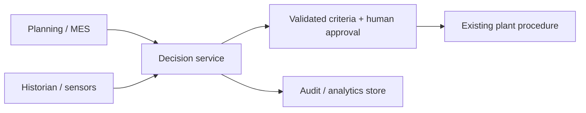

# Deployment

## Prototype

The local server uses only the Python standard library. It exposes `GET /api/batches`, `POST /api/optimize`, `POST /api/cleaning/start`, `POST /api/water/analyze`, `POST /api/impact/calculate`, `GET /api/audit-log`, and `GET /api/assumptions`.

## Target integration architecture — not connected to L’Oréal systems

Real deployment requires plant cyber review, network segmentation, identity and role control, input validation, audit retention, change management, quality approval, and OT integration testing. No production connection exists in this prototype.
