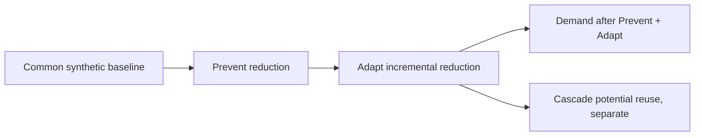

# Water and impact accounting

## Boundary

The implemented ledger quantifies only **modeled cleaning-water demand** inside a synthetic changeover scenario. It does not quantify withdrawal, consumption, discharge, treatment performance, carbon, chemicals, or financial outcome.

## Incremental accounting

`Prevent` is calculated from the fixed-order baseline less the recommended sequence. `Adapt` is constrained to the remaining modeled demand. `Cascade` is potential recovered volume only, never added to water avoided. Inputs are clamped so volumes cannot be negative.

## Reuse boundary

Recovered does not mean reusable. The cascade screen can return potentially reusable subject to validation, treatment required, or insufficient information. It cannot approve use.

## Not quantified

CO2e impact is not quantified because no verified energy, treatment, boundary or emission-factor method is available. Financial outcomes are not quantified because site-specific economics are unavailable.
