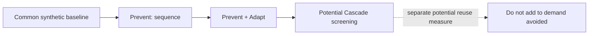

# Methodology and metric boundaries

## Definitions

| Metric | Definition / formula | Unit | Scope / limitation |
|---|---|---|---|
| Water demand | Modeled cleaning water required for a transition under prototype rules | L/changeover | Synthetic simulation only |
| Water avoided | Common baseline demand − demand after a specified layer | L | Only valid for the stated synthetic baseline |
| Water recovered | Modeled volume collected after a cleaning event | L | Does not imply it can be reused |
| Potential reuse | Recovery volume that passes an illustrative screen | L | Requires site quality, regulatory and safety validation |
| Water reused | Volume actually used after validated approval | L | Not measured by this prototype |
| Cleaning time avoided | Baseline duration − scenario duration | min | Synthetic only |
| Water withdrawal / consumption / discharge / intensity | Not quantified | — | Plant boundary and metering are unavailable |

## Dependency graph

The ledger reports Prevent and Adapt as incremental reductions against the preceding layer. Cascade is shown separately; it is never added to avoided demand.

## Experiment protocol

Use seeds 2026–2125 to generate 100 deterministic synthetic queues. For each seed, retain the fixed-order baseline and optimized sequence, report mean, median, standard deviation, min, max, feasibility rate and all configuration versions. Do not claim a result until this experiment has been run and retained in `data/`.

## Executed synthetic experiment

`scripts/run_experiments.py` was run with seeds 2026–2125 and generated [`data/synthetic_experiment_2026.1.json`](../data/synthetic_experiment_2026.1.json). All 100 synthetic scenarios were feasible under the prototype's limited constraints. The modeled reduction distribution was: mean **158.66 L**, median **142.05 L**, standard deviation **145.92 L**, minimum **0 L**, maximum **799.6 L**, and 10th–90th percentile **0–332 L**. These are **SYNTHETIC_DATA** model outputs, not measured L’Oréal savings. They are reported to expose distribution and no-improvement cases, not to forecast a plant outcome.
